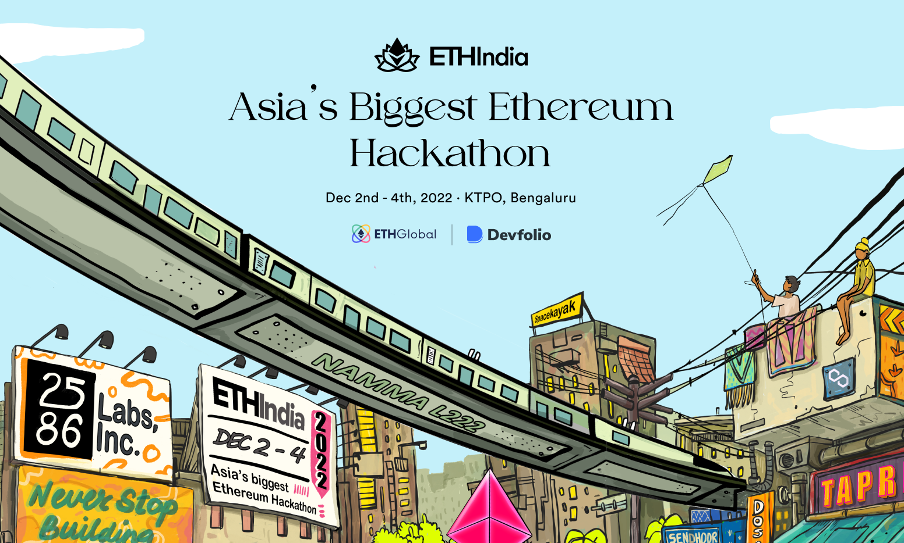
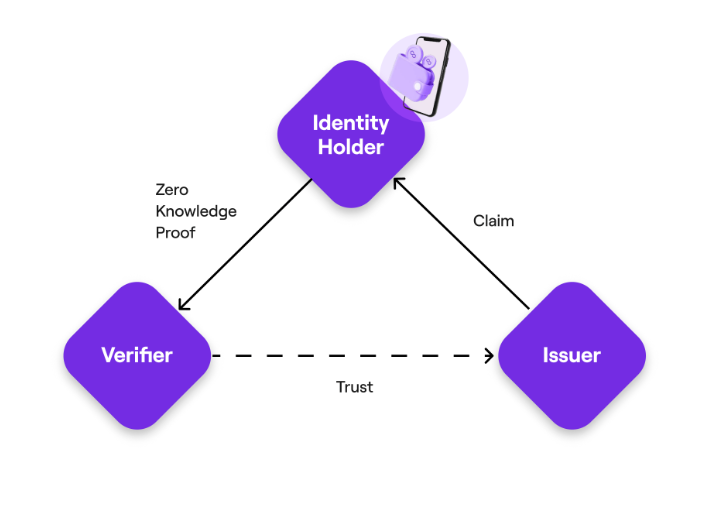
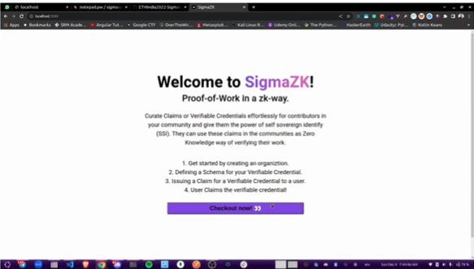
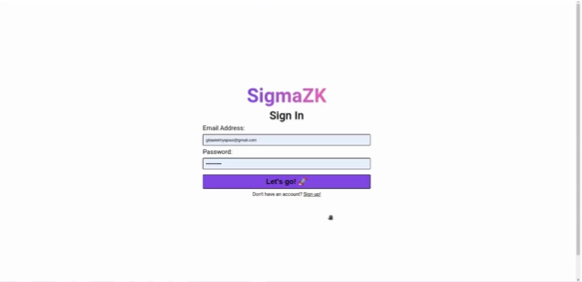
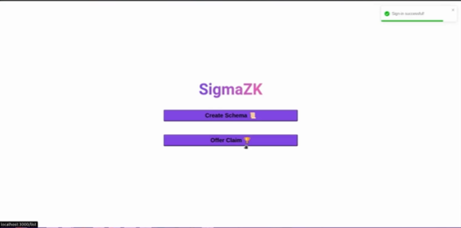
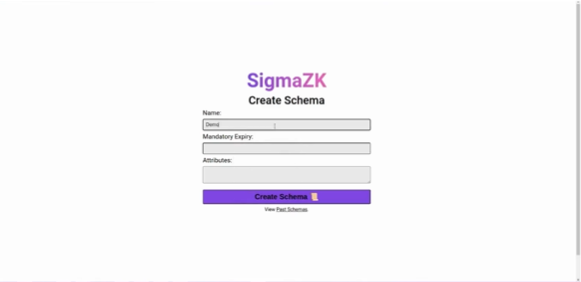
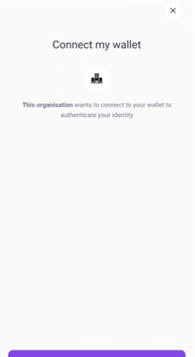
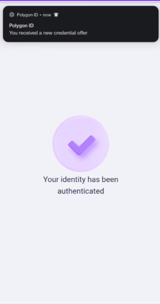
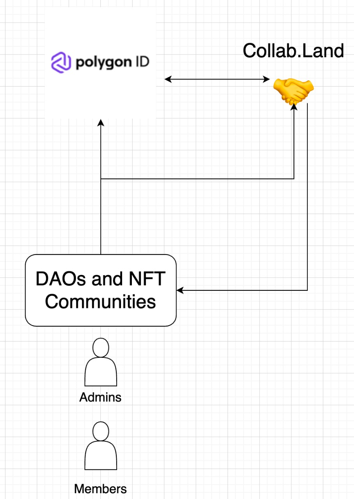
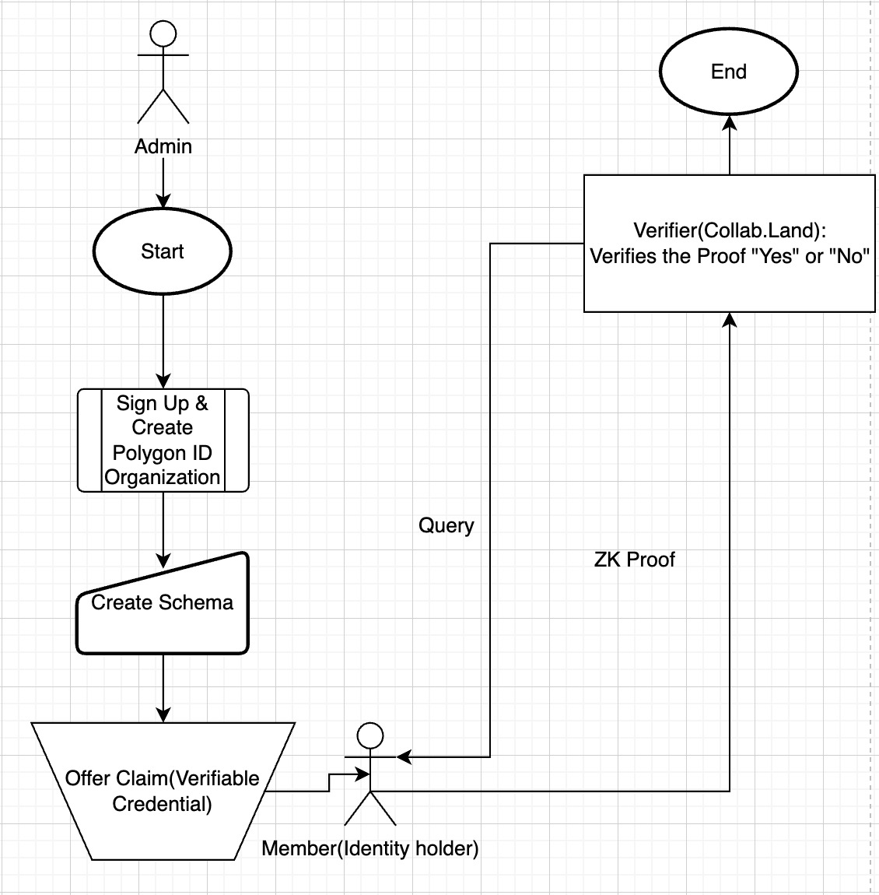

  

  

 

<b>SigmaSoiBois presents SigmaZK.
 
Proof of Work in a Zero knowledge way</b>

<blockquote align="center">built on ☕ at <a href="https://ethindia.co/">ETHIndia</a>.

</blockquote>

# 💡 Goals

- Use Polygon ID to have collab.land as an issuer and verifier whilst allowing for discod admins and community managers more power to manage their community. 

# 🧠 Knowledge Primer

- A _PolygonID_ Based on the principles of Self-Sovereign Identity (SSI) and cryptography, Polygon ID is a decentralised and permissionless identity framework for web2 and web3 applications. The SSI framework lets individuals own and control their identities.
- Core components in the Polygon ID
  - **Issuer** In our POC, the issuer is <b>[collab.land](https://www.collab.land/)</b>
    - An entity that issues claims to the Holders. 
  - **Verifier** It requests the holder to send proof based on the claims they hold in their wallet. 
    - A _core concept_ is that trust must exist between a verifier and issuer. 

  

# 📺 Preview

  

  

  

  

# Mobile Application 

  

  

# 💻 Tech Stack

- Polygon ID
- collab.land
- MERN 
- Typescript 
- Digital Ocean 
- Dune 

# 📦 Inside the box
## 1. System Architecture Diagram

  

- Let's assume the flow begins with Admins in charge of DAOs and NFT Communities. 
- collab.land acts as the issuer and verifier in our case and Polygon ID is the bridge in between them. 

## 2. Flow Diagram 

  

- The flow of the app begins with the admins who are the enforcers in the DAOs or NFT Communities. 
- Once they sign up and create a Polygon ID associated with an organisation, they can create a schema based on which the ZK system is to be implemented. 
- The members of the DAO or NFt community can claim offer (verifiable credential) by scanning the QR provided or deep linking. 
- We have assumed collab.land to be the issuer and the verifier. It looks up into the chain and validates the proof. 
- Once the claim is verified, the associated benefits as new roles and more are assigned to people on discord. 

# ⏭️ What's next

- Extending this system to more sophististicated systems. 

#   Challenges we ran into

- Initially we planned on using Dune for analytics in our project. We implemented the same, but later came to realise that as ours is a zero knowledge system we couldn't have any deep level analytics on the same. 
- We also planned on using push protocol that'd notify users when they had successfully claimed an offer. As Push protocol requires the wallet addresses of the people who use it and our system is a zero knowledge system, we had to scrape that plan as well. 

# 📜 License

`SigmaZK` is available under the MIT license. See the [`LICENSE`](Enter URL) file for more info.

# 🤝 Contributing

Please read [`Contributing.md`](Enter URL) for details on our code of conduct, and the process for submitting pull requests to us.

# 💥 Contributors

                                                                                  
# 🚨 Forking this repo

Many people have contacted us asking if they can use this code for their own websites. The answer to that question is usually "yes", with attribution. There are some cases, such as using this code for a business or something that is greater than a personal project, that we may be less comfortable saying yes to. If in doubt, please don't hesitate to ask us.

We value keeping this site open source, but as you all know, _**plagiarism is bad**_. We spent a non-negligible amount of effort developing, designing, and trying to perfect this iteration of our website, and we are proud of it! All we ask is to not claim this effort as your own.

Refer to this handy [quora post](https://www.quora.com/Is-it-bad-to-copy-other-peoples-code) if you're not sure what to do. Thanks!
